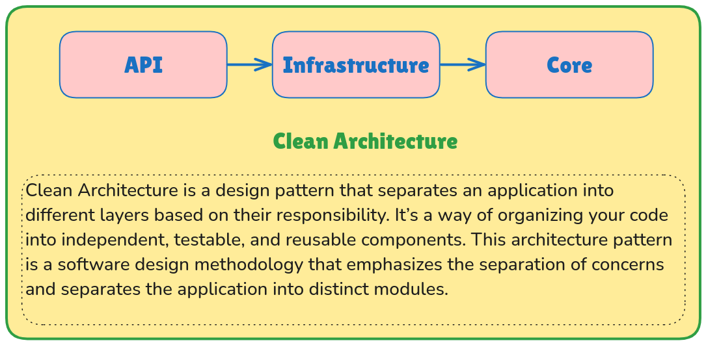

# Library Books Gallery

## Description
Library Gallery is a robust and scalable application designed to manage and showcase a collection of books. Built with clean architecture principles, it ensures maintainability, testability, and scalability. Using .NET 8, Entity Framework Core, and PostgreSQL, the application provides a seamless experience for managing and displaying book records.

## Features
- **Book Management**: Add, update, and delete book records with ease.
- **Search and Filter**: Quickly find books using search and filter functionalities.
- **Detailed Book Information**: View comprehensive details about each book, including title, description, publication date, language, ISBN, publisher, and more.
- **Image Support**: Upload and display book cover images.
- **Environment Configuration**: Seamlessly switch between development, testing, and production environments using configuration files.

## Clean Architecture (Onion)
The application is structured following clean architecture principles, which include:
- **Separation of Concerns**: Dividing the application into distinct layers (API, Core, Infrastructure) to ensure each layer has a specific responsibility.
- **Dependency Inversion**: High-level modules do not depend on low-level modules. Both depend on abstractions.
- **Testability**: Each layer can be tested independently, ensuring high code quality and reliability.

#### Patterns
- **API (Presentation Layer)**: This layer interacts with the external world. In your case, it's the Web API exposing endpoints to clients. It communicates with the Core layer to execute business logic.

- **Infrastructure (Infrastructure Layer)**: This layer implements the interfaces defined in the core. It includes the persistence layer (e.g., Entity Framework) and other integrations (e.g., third-party APIs).

- **Core (Domain Layer)**: This layer is where the business rules and logic reside. It is independent of any external frameworks or services and only defines the essential business rules and structures. 




## Installation
1. Install the .NET Core 8 SDK from the official .NET website:
   [Download .NET Core 8 SDK](https://dotnet.microsoft.com/download/dotnet/8.0)

   Follow the instructions for your operating system to complete the installation.

2. Verify the installation by running the following command in your terminal or command prompt:
   ```sh
   dotnet --version
   ```

   You should see the version number of the .NET Core 8 SDK you installed.

## Usage
1. Copy the `.env.example` file to `.env`:
   ```sh
   cp API/.env.example API/.env
   ```

2. Configure the `.env` file with the appropriate settings for your environment.

3. Update the database using Entity Framework:
   ```sh
   dotnet restore
   cd API
   dotnet ef database update
   ```

4. Run the application:
   ```sh
   dotnet run
   ```

5. Visit Swagger API
   ```sh
   http://localhost:5194/swagger/index.html
   ```


## Docker

install postgres and redis in docker
   ```sh
   docker compose --env-file API/.env up -d
   ```


